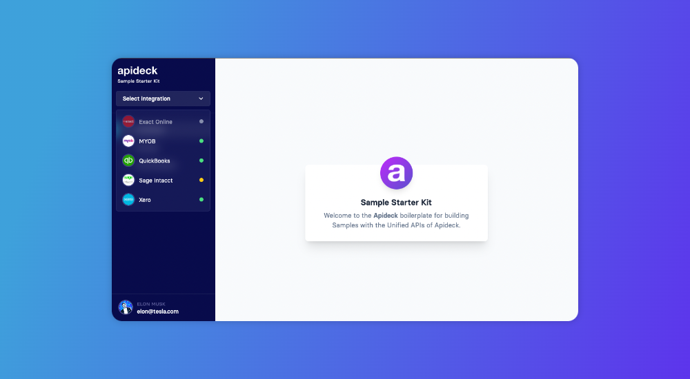

# Sample Starter Kit


#### A starter kit for building projects with the Unified APIs of [Apideck](https://developers.apideck.com/).

Use a single API to push and query data from multiple connectors. In this starter kit, we use the [Apideck Unify SDK](https://www.npmjs.com/package/@apideck/unify) to create sessions, manage connections, and fetch data from different connectors.
<br>

## Quick overview

Execute [`create-next-app`](https://github.com/vercel/next.js/tree/canary/packages/create-next-app) with [npm](https://docs.npmjs.com/cli/init) or [Yarn](https://yarnpkg.com/lang/en/docs/cli/create/) to bootstrap the starter kit:

```bash
npx create-next-app --example https://github.com/apideck-samples/sample-starter-kit
# or
yarn create next-app --example https://github.com/apideck-samples/sample-starter-kit
```



## Tech Stack

- **Next.js 15** - React framework with App Router
- **React 18** - React with improved performance
- **TypeScript 5.7** - Type safety
- **Tailwind CSS 3.4** - Utility-first CSS framework
- **TanStack Query 5** - Data fetching and state management
- **Apideck Unify SDK** - Unified API integration
- **Apideck Components** - Pre-built UI components
- **Apideck React Vault** - Integration management UI

## Getting started

### Requirements

- **An Apideck account**: You can sign up for an Apideck account here: https://app.apideck.com/signup
- **Apideck Application ID**: Available in your Apideck dashboard.
- **Apideck API Key**: Available in your Apideck dashboard.

### Installing the sample

This project uses the Accounting API as an example with the Unify SDK. Visit [Accounting Reference](https://developers.apideck.com/apis/accounting/reference) for documentation of the API and [Apideck Unify](https://www.npmjs.com/package/@apideck/unify) for documentation about the SDK.

To use a different API, for example CRM, you could simply switch the `UNIFIED_API` variable in `src/app/api/vault/connections/route.ts` from `accounting` to `crm`.

The `useCustomers` hook is an example of how to fetch customers with the Accounting API. This code can be removed or replaced.

### Features

- 🔐 **Session Management** - Create and manage Vault sessions for consumers
- 🔌 **Connection Grid** - Visual grid interface to browse and select integrations
- 📊 **Customers Example** - Full CRUD example using the Accounting API
- 🌐 **Ecosystem Browser** - Interactive carousel showcasing how to embed [Apideck Ecosystem](https://www.apideck.com/ecosystem) marketplaces in your app
- 🎨 **Dark Mode** - Full dark mode support throughout the application
- 📱 **Responsive Design** - Mobile-first design that works on all devices

#### Step 1: Enable connectors

Login to Apideck and enable the connectors you would like to make available to your customers.

You can find the overview of connectors here: https://platform.apideck.com/configuration.

#### Step 2: Update your environment variables

- Copy `.env.example` and create a `.env.local` file
- Add your API key: `APIDECK_API_KEY=<your-api-key>`
- Add your Application ID: `APIDECK_APP_ID=<your-app-id>`

Note: You can find your credentials in the admin: https://platform.apideck.com/configuration/api-keys

#### Step 3: Install dependencies

- Install dependencies with `yarn` or `npm install`
- Run the development server with `yarn dev` or `npm run dev`
- Visit `http://localhost:3000/` to see if it&apos;s running. If you haven&apos;t configured any integrations you will see a message.

#### Step 4: Create a session and add connections

You need to create a Vault session and add/configure at least one accounting connection. Use the button on the `/invalid-session` route to create a test session for a specific consumer (by passing the consumer ID). After creating a session you can click the integrations dropdown in the sidebar to select a connector. Make sure you have the Accounting connectors enabled in the admin: https://platform.apideck.com/configuration/accounting.

You should now be able to load and manage the customers and more from the connections you have configured.

## Commands

#### `yarn dev` or `npm run dev`

Runs `next dev` which starts the app in development mode.<br>
Open [http://localhost:3000](http://localhost:3000) to view it in the browser.

#### `yarn build` or `npm run build`

Runs `next build` which builds the application for production usage

#### `yarn start` or `npm start`

Runs `next start` which starts a Next.js production server

#### `yarn lint` or `npm run lint`

Runs the Next.js built-in ESLint command for all files.

#### `yarn lint:fix` or `npm run lint:fix`

Runs the ESLint command with the `--fix` flag which tries to automatically fix linting problems.

#### `yarn format` or `npm run format`

Runs Prettier which formats all files inside the `src` directory based on the configuration set inside the `.prettierrc` file.

#### `yarn type-check` or `npm run type-check`

Runs the `tsc` command to compile the project and check if it has type errors.

## Project Structure

```
src/
├── app/                    # App Router pages and API routes
│   ├── api/               # API Route Handlers
│   │   ├── accounting/    # Accounting API endpoints
│   │   │   └── customers/ # Customer endpoints
│   │   └── vault/         # Vault API endpoints
│   │       ├── connections/ # Connections endpoint
│   │       └── sessions/    # Sessions endpoint
│   ├── customers/         # Customers page
│   ├── ecosystem/         # Ecosystem browser page
│   ├── layout.tsx         # Root layout with providers
│   └── page.tsx           # Home page with session creation
├── components/            # React components
│   ├── customers/         # Customer-specific components
│   ├── ConsumerDropdown.tsx
│   ├── Layout.tsx
│   ├── PageHeading.tsx
│   ├── SelectConnection.tsx
│   ├── SelectConnectionGrid.tsx
│   ├── SessionGuard.tsx
│   ├── SessionPreviewCard.tsx
│   └── SidebarLayout.tsx
├── lib/                   # Utility libraries
│   └── apideck.ts         # Apideck SDK initialization
├── providers/             # React context providers
│   ├── client-providers.tsx
│   └── query-provider.tsx
├── styles/                # Global styles
├── types/                 # TypeScript types
└── utils/                 # Utility functions and hooks
    ├── createVaultSession.ts
    ├── useConnections.tsx
    ├── useCookieState.tsx
    ├── useCustomers.tsx
    └── useSession.tsx
```

## Key Features & Pages

### Home Page (`/`)

- Session creation form with consumer metadata
- Session preview card showing active consumer information
- Quick access to Vault and connection management

### Customers Page (`/customers`)

- Grid view of customers from connected accounting integrations
- Real-time data fetching with TanStack Query
- Example implementation of Accounting API usage

### Ecosystem Page (`/ecosystem`)

- Interactive carousel showcasing Apideck Ecosystem examples
- Demonstrates how to embed integration marketplaces inside your own product using iframes
- Browse through 8+ live ecosystem examples (Aikido, Beekeeper, Personio, etc.)
- Full-screen iframe viewer with navigation controls
- **Note**: Ecosystems are part of [Apideck Ecosystem](https://www.apideck.com/ecosystem), a separate product that allows you to create branded integration marketplaces. This page showcases how you can embed these marketplaces directly into your application.

### Components

- **SessionGuard** - Protects routes and ensures valid session
- **SelectConnectionGrid** - Visual grid for browsing available integrations
- **ConsumerDropdown** - Shows consumer metadata in sidebar
- **SessionPreviewCard** - Displays current session information

## Resources

To learn more, take a look at the following resources:

### Apideck Resources

- [Apideck Unify SDK](https://www.npmjs.com/package/@apideck/unify) - TypeScript/JavaScript SDK for Apideck Unify
- [Apideck Ecosystem](https://www.apideck.com/ecosystem) - Create branded integration marketplaces
- [Accounting API](https://www.apideck.com/accounting-api) - Info about the Accounting API of Apideck
- [Accounting API Documentation](https://developers.apideck.com/apis/accounting/reference) - Documentation of the Accounting API
- [Accounting API Explorer](https://developers.apideck.com/apis/accounting/api-explorer) - API explorer to test endpoints
- [Vault API Documentation](https://developers.apideck.com/apis/vault/reference) - Documentation of the Vault API
- [Vault API Explorer](https://developers.apideck.com/apis/vault/api-explorer) - API explorer to test Vault endpoints
- [Apideck Components](https://www.npmjs.com/package/@apideck/components) - Pre-built React UI components
- [Apideck React Vault](https://www.npmjs.com/package/@apideck/react-vault) - React component for Vault integration

### Development Resources

- [Next.js Documentation](https://nextjs.org/docs) - Learn about Next.js features and API
- [Next.js App Router](https://nextjs.org/docs/app) - Learn about the App Router
- [TypeScript](https://www.typescriptlang.org/) - Learn about TypeScript
- [Tailwind CSS](https://tailwindcss.com/) - Learn about the utility-first CSS framework
- [TanStack Query](https://tanstack.com/query/latest) - Learn about powerful data fetching
- [ESLint](https://eslint.org/) - Learn about analyzing code with ESLint
- [Prettier](https://prettier.io/) - Learn about formatting code with Prettier
